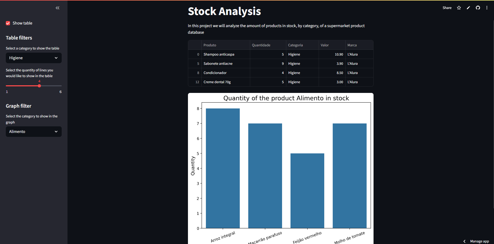

# Stock analysis app
Simple stock analysis app with Streamlit and Python

## Required step

 ### ***Create the ambient***
> python -m venv venv

### ***Activate the ambient***
* On Windows
> venv\Scripts\activate

* On Linux or Mac
> source venv/bin/activate

### ***Install the requirements***
> pip install -r requirements.txt

### ***Run the App***
streamlit run app.py

## ***URL to the project***
https://stock-analysis-with-python.streamlit.app

